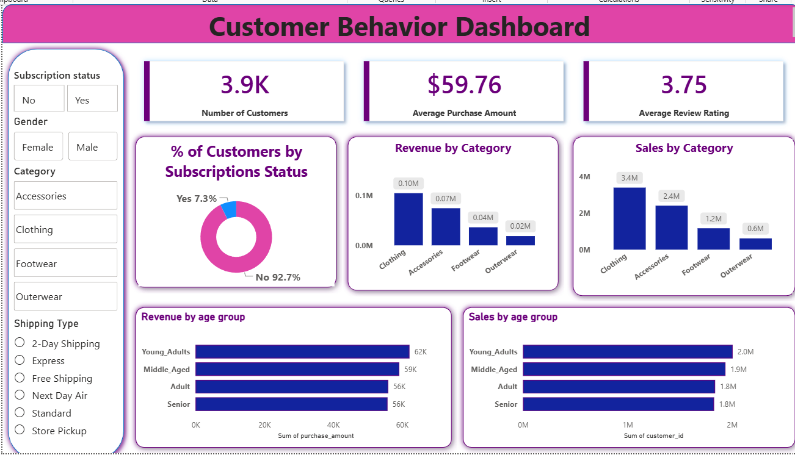

# Customer Shopping Behavior Analysis

## Project Overview

This is an end-to-end Data Analytics project focused on analyzing customer shopping behavior and purchasing patterns.

The project uses **Excel, MySQL, and Power BI** to explore customer demographics, purchasing behavior, product preferences, subscription status, discounts, shipping choices, and repeat purchasing patterns.

The goal of the project is to transform customer shopping data into meaningful business insights using SQL analysis and an interactive Power BI dashboard.

---

## Tools & Technologies

- **Excel** – Dataset preparation and data handling
- **MySQL** – Data analysis and business query development
- **SQL** – Business analysis, aggregations, subqueries, CTEs, and customer segmentation
- **Power BI** – Data modeling, DAX measures, visualization, and dashboard development
- **GitHub** – Project documentation and portfolio presentation

---

## Project Workflow

**Customer Dataset → Data Preparation → MySQL Analysis → Power BI Dashboard → Business Insights**

---

## Dataset

The project uses a customer shopping behavior dataset containing **3,900 customer records**.

The dataset includes information related to:

- Customer demographics
- Age and gender
- Purchased items
- Product categories
- Purchase amount
- Location
- Size and color
- Season
- Review ratings
- Subscription status
- Shipping type
- Discount usage
- Promo code usage
- Previous purchases
- Payment methods
- Frequency of purchases

The dataset used for this project is available in the `data` folder.

---

## SQL Analysis

MySQL was used to analyze the customer shopping data and answer business-related questions.

The SQL analysis covers:

- Customer spending behavior
- Customers spending above the average purchase amount
- Product review ratings
- Shipping method preferences
- Subscriber vs non-subscriber spending
- Discount usage by product
- Customer segmentation based on previous purchases
- Repeat buyer behavior
- Product performance
- Revenue contribution
- Customer age-group analysis

SQL techniques demonstrated include:

- Aggregate functions
- `GROUP BY`
- `ORDER BY`
- Subqueries
- Common Table Expressions (CTEs)
- `CASE` statements
- Conditional aggregation
- Customer segmentation

The complete SQL analysis is available in the `sql` folder.

---

## Customer Segmentation

Customers were segmented based on their previous purchase history to better understand purchasing behavior.

The segmentation logic categorizes customers into groups such as:

- **New Customers**
- **Returning Customers**
- **Loyal Customers**

This helps identify differences in purchasing behavior across different levels of customer engagement.

---

## Power BI Dashboard

An interactive Power BI dashboard was developed to visualize customer shopping behavior and key business metrics.

The dashboard provides a business-friendly overview of customer demographics, purchasing patterns, category performance, subscription behavior, and customer preferences.

### Key Dashboard KPIs

- **Number of Customers:** 3.9K
- **Average Purchase Amount:** $59.76
- **Average Review Rating:** 3.75

### Dashboard Analysis

The dashboard includes analysis of:

- Customer count
- Average purchase amount
- Average review rating
- Subscription status
- Revenue by product category
- Sales by product category
- Revenue by age group
- Sales by age group
- Customer gender
- Shipping type
- Product category
- Interactive filtering and slicers

---

## Customer Behavior Dashboard



---

## Key Insights

- The dataset contains approximately **3.9K customer records**.
- The average purchase amount is approximately **$59.76**.
- The average review rating is approximately **3.75**.
- Non-subscribers represent the majority of customers in the dataset.
- **Clothing** is a major contributor to overall category performance.
- Customer purchasing patterns vary across different age groups.
- Subscription status, gender, category, and shipping type can be used to explore customer behavior interactively.
- Customer purchase history can be used to identify new, returning, and loyal customer groups.
- Discount and subscription analysis can help businesses better understand customer purchasing preferences.

---

## Repository Structure

```text
customer-shopping-behavior-analysis/
│
├── data/
│   ├── Customer Shopping Behavior.xlsx
│   └── README.md
│
├── sql/
│   ├── Customer_Shopping_Behavior_SQL.sql
│   └── README.md
│
├── powerbi/
│   ├── Customer_behavior visualisation.pbix
│   └── README.md
│
├── screenshots/
│   ├── Customer_Behavior_Dashboard.png
│   └── README.md
│
└── README.md
