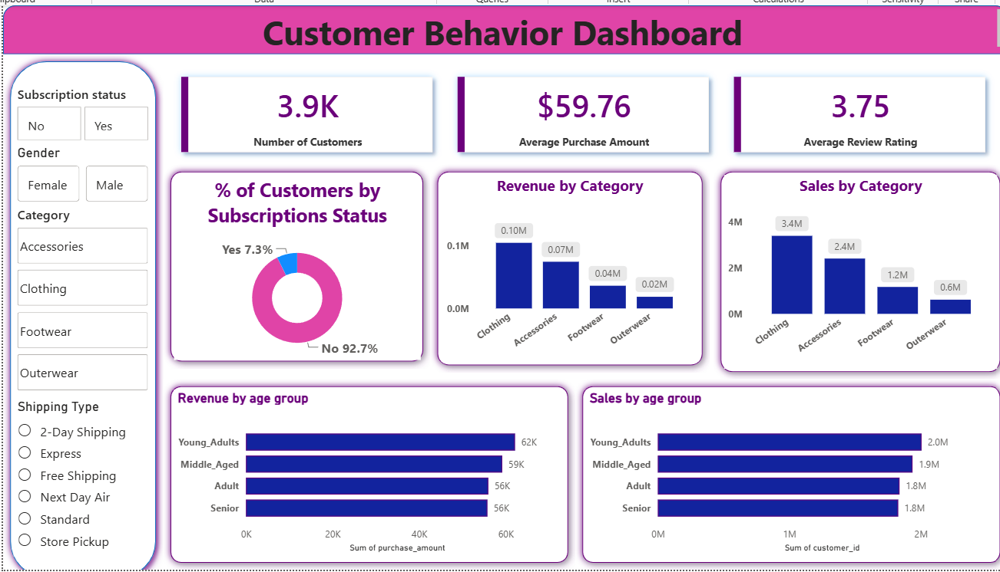

# Customer Shopping Behavior Analysis

## Internship Project | Data Analyst Intern

**Organization:** B Dreams Global Solutions  
**Role:** Data Analyst Intern  
**Duration:** 6 Months  
**Project:** Customer Shopping Behavior Analysis  
**Tools:** Excel, MySQL, SQL, Power BI, GitHub

---

## Project Overview

This is an end-to-end Data Analytics project completed as part of my **6-month Data Analyst internship at B Dreams Global Solutions**.

The project focuses on analyzing customer shopping behavior, purchasing patterns, product preferences, and customer engagement using **Excel, MySQL, SQL, and Power BI**.

The analysis explores customer demographics, purchase amounts, product categories, subscription status, discount usage, shipping preferences, customer segmentation, and repeat purchasing patterns.

The primary objective is to transform customer shopping data into meaningful business insights through data preparation, SQL-based analysis, customer segmentation, KPI development, and an interactive Power BI dashboard.

This project demonstrates my practical experience in data analytics, business analysis, data visualization, and dashboard development.

---

## Internship Details

| Particulars | Details |
|---|---|
| Organization | B Dreams Global Solutions |
| Role | Data Analyst Intern |
| Duration | 6 Months |
| Project Title | Customer Shopping Behavior Analysis |
| Domain | Data Analytics |
| Tools Used | Excel, MySQL, SQL, Power BI |
| Project Type | End-to-End Data Analytics |
| Key Areas | Data Preparation, SQL Analysis, Customer Segmentation, Dashboard Development, Business Insights |

### Internship Responsibilities Demonstrated Through This Project

- Prepared and explored customer shopping data for analysis.
- Examined customer demographics, purchasing behavior, and product preferences.
- Used MySQL and SQL to perform business-related data analysis.
- Applied SQL queries, aggregations, subqueries, CTEs, and conditional logic.
- Analyzed customer spending, product performance, discounts, and shipping preferences.
- Segmented customers based on previous purchase history.
- Developed KPIs and interactive visualizations in Power BI.
- Created a dashboard to communicate customer behavior and business insights.
- Documented the project workflow, analytical findings, and deliverables.

---

## Project Objectives

- Analyze customer shopping behavior and purchasing patterns.
- Understand customer demographics and product preferences.
- Prepare and organize customer data for analysis.
- Use SQL to answer business-related questions.
- Identify customer spending trends and product performance.
- Compare subscriber and non-subscriber purchasing behavior.
- Analyze discount usage and shipping preferences.
- Segment customers based on previous purchase history.
- Develop KPIs and interactive Power BI visualizations.
- Present meaningful insights to support data-driven business decisions.

---

## Tools & Technologies

- **Microsoft Excel** – Dataset review, preparation, and data handling.
- **MySQL** – Database management and business query development.
- **SQL** – Data analysis, aggregations, subqueries, CTEs, conditional logic, and customer segmentation.
- **Power BI** – Data modeling, DAX measures, visualization, and dashboard development.
- **Power Query** – Data transformation and preparation.
- **DAX** – KPI calculations and analytical measures.
- **GitHub** – Project documentation, version control, and portfolio presentation.

---

## Project Workflow

**Customer Dataset → Data Preparation → MySQL Database → SQL Analysis → Customer Segmentation → Power BI Dashboard → Business Insights**

### 1. Data Understanding

Reviewed the customer shopping dataset to understand its structure, columns, data types, and business context.

Identified relevant attributes for analyzing customer demographics, purchase behavior, product categories, payment methods, subscription status, and shopping preferences.

### 2. Data Preparation

Prepared and organized the dataset for analysis by reviewing the available fields and checking data consistency.

The prepared data was used for SQL-based analysis and Power BI dashboard development.

### 3. MySQL Database and SQL Analysis

Used MySQL to query and analyze customer shopping data.

Developed SQL queries to investigate customer spending, purchasing patterns, product performance, customer segments, and business-related questions.

### 4. Customer Segmentation

Analyzed previous purchase history to group customers into meaningful segments, including new, returning, and loyal customers.

### 5. Power BI Dashboard Development

Developed an interactive Power BI dashboard to visualize customer demographics, purchasing behavior, product category performance, and key business metrics.

### 6. Business Insights

Interpreted the analysis and dashboard findings to understand customer behavior, purchasing trends, and opportunities for further business investigation.

---

## Dataset

The project uses a customer shopping behavior dataset containing **3,900 customer records**.

The dataset includes information related to:

- Customer ID
- Customer demographics
- Age and gender
- Purchased items
- Product categories
- Purchase amount
- Location
- Size and color
- Season
- Review ratings
- Subscription status
- Shipping type
- Discount usage
- Promo code usage
- Previous purchases
- Payment methods
- Frequency of purchases

The dataset used for this project is available in the `data` folder.

---

## SQL Analysis

MySQL was used to analyze customer shopping data and answer business-related questions.

### Business Questions Analyzed

- What is the customer spending behavior?
- Which customers spend above the average purchase amount?
- How do product review ratings vary?
- Which shipping methods are preferred by customers?
- How does spending differ between subscribers and non-subscribers?
- How are discounts used across products?
- How can customers be segmented based on previous purchases?
- What does repeat buyer behavior reveal?
- How do product categories perform?
- How is revenue distributed across categories?
- How does purchasing behavior vary across age groups?

### SQL Techniques Demonstrated

- `SELECT`
- `WHERE`
- `ORDER BY`
- `GROUP BY`
- `HAVING`
- Aggregate functions
- `COUNT()`
- `SUM()`
- `AVG()`
- Subqueries
- Common Table Expressions (CTEs)
- `CASE` statements
- Conditional aggregation
- Customer segmentation

The complete SQL analysis is available in the `sql` folder.

---

## Customer Segmentation

Customers were segmented based on their previous purchase history to better understand purchasing behavior and customer engagement.

### Customer Segments

- **New Customers:** Customers with limited purchase history.
- **Returning Customers:** Customers who have made previous purchases.
- **Loyal Customers:** Customers with a stronger history of repeat purchases.

This segmentation helps identify differences in purchasing behavior across customer groups and supports further analysis of customer engagement and retention.

---

## Power BI Dashboard

An interactive Power BI dashboard was developed to visualize customer shopping behavior and key business metrics.

The dashboard provides a business-friendly overview of customer demographics, purchasing patterns, product category performance, subscription behavior, and customer preferences.

### Key Dashboard KPIs

| KPI | Result |
|---|---:|
| Number of Customers | 3.9K |
| Average Purchase Amount | $59.76 |
| Average Review Rating | 3.75 |

### Dashboard Analysis

The dashboard includes analysis of:

- Customer count
- Average purchase amount
- Average review rating
- Subscription status
- Revenue by product category
- Sales by product category
- Revenue by age group
- Sales by age group
- Customer gender
- Shipping type
- Product category
- Interactive filtering and slicers

### Power BI Skills Demonstrated

- Data modeling
- Data transformation using Power Query
- DAX measures
- KPI development
- Data visualization
- Interactive dashboard development
- Business reporting

---

## Customer Behavior Dashboard



---

## Key Insights

- The dataset contains approximately **3.9K customer records**.
- The average purchase amount is approximately **$59.76**.
- The average review rating is approximately **3.75**.
- Non-subscribers represent the majority of customers in the dataset.
- **Clothing** is a major contributor to overall category performance.
- Customer purchasing patterns vary across different age groups.
- Subscription status, gender, category, and shipping type can be used to explore customer behavior interactively.
- Customer purchase history can be used to identify new, returning, and loyal customer groups.
- Discount and subscription analysis can help businesses better understand customer purchasing preferences.

---

## Business Value

This project demonstrates how customer shopping data can be transformed into meaningful business information through structured analysis and visualization.

The analysis can help businesses:

- Understand customer purchasing behavior and preferences.
- Explore customer demographics and product category trends.
- Compare customer segments and subscription behavior.
- Review product ratings and shipping preferences.
- Examine discount usage and repeat purchasing patterns.
- Monitor key customer and purchase metrics.
- Support data-driven business discussions and decisions.

---

## Skills Demonstrated

### Technical Skills

- Data Analytics
- Data Preparation
- Data Cleaning Concepts
- Exploratory Data Analysis (EDA)
- SQL Querying
- MySQL
- Microsoft Excel
- Power BI
- DAX
- Power Query
- Data Modeling
- Data Visualization
- KPI Reporting
- Customer Segmentation
- Dashboard Development

### Analytical and Business Skills

- Business Analysis
- Customer Behavior Analysis
- Purchasing Pattern Analysis
- Revenue Analysis
- Product Performance Analysis
- Data Interpretation
- Analytical Thinking
- Business Insight Generation
- Reporting and Documentation

---

## Project Deliverables

- Customer shopping dataset
- Data preparation and analysis
- MySQL database and SQL queries
- Customer segmentation analysis
- Power BI dashboard
- Key performance indicators
- Business insights and findings
- Project documentation

---

## Repository Structure

```text
customer-shopping-behavior-analysis/
│
├── data/
│   ├── Customer Shopping Behavior.xlsx
│   └── README.md
│
├── sql/
│   ├── Customer_Shopping_Behavior_SQL.sql
│   └── README.md
│
├── powerbi/
│   ├── Customer_behavior visualisation.pbix
│   └── README.md
│
├── screenshots/
│   ├── Customer_Behavior_Dashboard.png
│   └── README.md
│
└── README.md
```

---

## Project Outcome

Successfully completed an end-to-end Customer Shopping Behavior Analysis project as part of my Data Analyst internship at **B Dreams Global Solutions**.

The project involved customer data preparation, SQL-based business analysis, customer segmentation, KPI development, and interactive Power BI dashboard creation.

Through this project, I applied data analytics tools and techniques to explore customer purchasing patterns, examine business metrics, and present findings through visual reporting.

---

## About Me

I am **Pavan Kumar N**, a Data Analytics professional with over **3 years of professional experience at CBRE**, followed by Data Analytics training and a **6-month Data Analyst internship at B Dreams Global Solutions**.

I have hands-on experience with **SQL, Python, Power BI, Excel, and Advanced Excel**, along with skills in data preparation, data analysis, data visualization, dashboard development, reporting, and business analysis.

My professional background in operations and reporting, combined with my data analytics training and internship experience, has helped me develop both analytical and business-oriented skills.

I am currently seeking opportunities as a **Data Analyst, Junior Data Analyst, BI Analyst, or MIS Analyst**, where I can apply my technical knowledge, analytical abilities, and professional experience to support business decisions.

### Connect With Me

- **Portfolio:** https://pavankumarn136-pixel.github.io/
- **GitHub:** https://github.com/pavankumarn136-pixel
- **LinkedIn:** https://www.linkedin.com/in/pavan-kumar-n-3677b1238/
